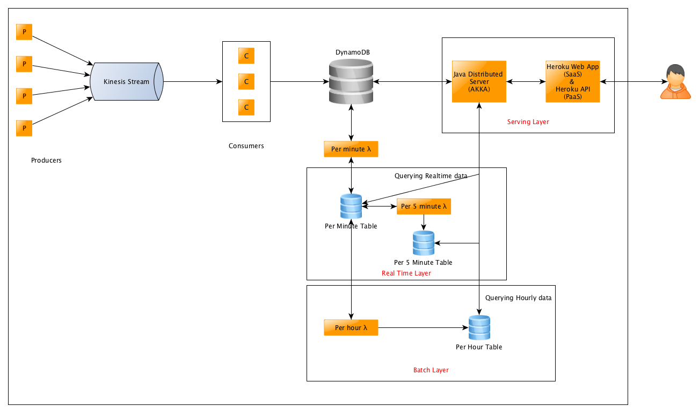

# Team 8 Project

## Code Structure:

### Dependencies for Producer and Consumer Scripts:
* textblob
* boto3
* praw
* TwitterAPI

Please install these dependencies on the machine running the consumer and producer code.

### [Producer Scripts](./ProducerScripts/CodeFiles/):
To run producer scripts, please run the following files:

* [producer_meetups.py](./ProducerScripts/CodeFiles/producer_meetups.py)
* [producer_reddit.py](./ProducerScripts/CodeFiles/producer_reddit.py)
* [producer_twitter.py](./ProducerScripts/CodeFiles/producer_twitter.py)

### [Consumer Scripts](./ConsumerScripts/):
To run the consumer scripts, please run the following files on two nodes:

* [vcl_script-multiprocessing-c1.py](./ConsumerScripts/vcl_script-multiprocessing-c1.py)
* [vcl_script-multiprocessing-c2.py](./ConsumerScripts/vcl_script-multiprocessing-c2.py)

### [Lambda Functions](./AWS_Lambda):
To run the Lambda Functions, please follow the following procedure:

* **Hourly Lambda:**
	* Create Lambda Canary Function on AWS Lambda
	* Add CloudWatch Event with time = 1 hour to the Lambda in the Configuration.
	* Add code from the [Hourly Lambda File](./AWS_Lambda/hourlyLambda.py) to the lambda function.
	* Update the environment variable for AWS Key and Secret.
	* Enable the CloudWatch Trigger.
* **Minute Lambda:** 
	* Create Lambda Canary Function on AWS Lambda
	* Add CloudWatch Event with time = 1 minute to the Lambda in the Configuration.
	* Add code from the [Minute Lambda File](./AWS_Lambda/minuteLambda.py) to the lambda function.
	* Update the environment variable for AWS Key and Secret.
	* Enable the CloudWatch Trigger.
* **5 Minute Lambda:**
	* Create Lambda Canary Function on AWS Lambda
	* Add CloudWatch Event with time = 5 minute to the Lambda in the Configuration.
	* Add code from the [5 Minute Lambda File](./AWS_Lambda/fiveMinuteLambda.py) to the lambda function.
	* Update the environment variable for AWS Key and Secret.
	* Enable the CloudWatch Trigger.

### AKKA Server & Heroku:

## System Architecture:

## [Project Report](./project-report.pdf)

